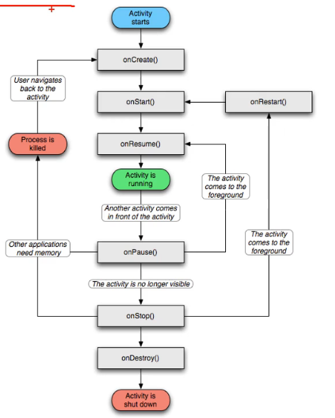

# 简述

# 四大组件

## Intent组件

`Intent` 是 Android 中用于在应用的不同组件（如 `Activity`、`Service` 和 `BroadcastReceiver`）之间传递消息和操作的关键机制。`Intent` 是 Android 的消息传递系统的基础，能够启动新的 `Activity`、发送广播、启动 `Service` 等等。它可以携带一些数据来传递给目标组件。

**作用**

1. **启动组件**：
   - 启动一个新的 `Activity`，通过显式或隐式 `Intent`。
   - 启动或绑定一个 `Service`。
   - 向 `BroadcastReceiver` 发送广播。
2. **传递数据**： `Intent` 可以附带额外的数据，比如键值对，用于传递到目标组件。通过 `Intent` 可以将简单的变量（如字符串、整数等）传递到下一个 `Activity` 或服务。

**类型**

`Intent` 分为两种主要类型：**显式 Intent** 和 **隐式 Intent**。

1. 显式 `Intent`（Explicit Intent）

显式 `Intent` 主要用于在应用程序内部启动某个指定的组件，比如启动一个特定的 `Activity` 或 `Service`。显式 `Intent` 通过指定目标组件的类名（即 `ComponentName`）来明确告诉系统哪个组件将处理这个 `Intent`。

示例：

启动一个特定的 `Activity`：

```
Intent intent = new Intent(CurrentActivity.this, TargetActivity.class);
startActivity(intent);
```

在这个例子中：

- `CurrentActivity` 是当前的活动。
- `TargetActivity` 是要启动的目标活动。系统明确知道应该启动哪一个组件。

2. 隐式 `Intent`（Implicit Intent）

隐式 `Intent` 不会直接指定目标组件，而是通过一个通用的动作（action）来描述想要执行的操作，然后由系统根据 `Intent` 的内容，查找合适的组件来处理。例如，可以使用隐式 `Intent` 来启动其他应用的组件，像打开网页、拨打电话或共享内容。

示例：

打开网页：

```java
Intent intent = new Intent(Intent.ACTION_VIEW);
intent.setData(Uri.parse("http://www.google.com"));
startActivity(intent);
```

在这个例子中：

- `Intent.ACTION_VIEW` 是一个内置的动作，表示查看某个数据（这里是网页）。
- `setData(Uri.parse("http://www.google.com"))` 指定要查看的数据是一个网址。

隐式 `Intent` 还可以被用来调用其他应用提供的功能，比如使用手机自带的相机应用拍照：

```java
Intent intent = new Intent(MediaStore.ACTION_IMAGE_CAPTURE);
startActivity(intent);
```

`Intent` 传递数据

`Intent` 可以通过 `putExtra()` 方法将附加数据传递给目标组件。你可以传递多种类型的数据，如字符串、整数、布尔值、数组等。目标组件可以通过 `getExtras()` 来获取这些数据。

`Intent` 的常见用途

1. **启动 `Activity`**： 使用 `Intent` 启动一个新的 `Activity` 或返回结果。

   ```java
   Intent intent = new Intent(CurrentActivity.this, SecondActivity.class);
   startActivity(intent);
   ```

2. **启动 `Service`**： 使用 `Intent` 启动或绑定到一个服务。

   ```java
   Intent intent = new Intent(this, MyService.class);
   startService(intent);
   ```

3. **发送广播**： 使用 `Intent` 发送广播，通知应用内的其他组件或系统事件。

   ```java
   Intent intent = new Intent("com.example.MY_CUSTOM_ACTION");
   sendBroadcast(intent);
   ```

4. **启动其他应用的组件**： 使用隐式 `Intent` 调用其他应用的功能，如共享内容或打开文件。

   ```java
   Intent intent = new Intent(Intent.ACTION_SEND);
   intent.setType("text/plain");
   intent.putExtra(Intent.EXTRA_TEXT, "This is my text to send.");
   startActivity(Intent.createChooser(intent, "Share using"));
   ```

常用的 `Intent` 动作（Actions）

`Intent` 动作可以告诉系统应该执行什么操作，以下是一些常见的内置 `Intent` 动作：

- `Intent.ACTION_VIEW`：用于查看某种数据，如网页、地图。
- `Intent.ACTION_SEND`：用于共享数据。
- `Intent.ACTION_DIAL`：打开拨号界面。
- `Intent.ACTION_CALL`：直接拨打电话（需要权限）。
- `Intent.ACTION_PICK`：选择某种数据，如图片、联系人。

`Intent` 是 Android 中用于不同组件之间通信的核心工具。通过显式 `Intent`，你可以在应用内部启动指定的组件；通过隐式 `Intent`，你可以调用系统或其他应用程序提供的功能。它还可以传递额外的数据，便于在不同组件之间共享信息。

## Acitivity

### activity跳转

```java
//1.在Intent的构造函数中指定
Intent intent new Intent (this,ActFinishActivity.class)
//2.调用意图对象的setC1ass方法指定
Intent intent new Intent ()
/intent.setClass(this,ActFinishActivity.class)i
//3.调用意图对象的setComponent.方法指定
ComponentName component new ComponentName (this,ActFinishActivity.class);// 可以传递包名
intent.setComponent (component);

startActivity(intent);
finish(); // 结束当前activity
```

### 数据传递

向下级Activity传递数据

```java
// 1、直接使用inent的putExtra方法
intent.putExtra();

// 2、使用bundle
Bundle bundle = new Bundle();
bundle.putString();
intent.putExtras(bundle);
```

下级向上级返回数据

```java
setResult(SubMainActivity.RESULT_OK,intent);
finish();
```

接收下级数据

```java
ActivityResultLauncher<Intent> register = registerForActivityResult(
    new ActivityResultContracts.StartActivityForResult(), 
    result ->  {
        if (result.getResultCode() == MainActivity.RESULT_OK) {
            Bundle bundle = result.getData().getExtras(); // 获取intent中保存的数据
        }0
    });

// 跳转Activity
register.launch(intent);
```


### 生命周期



- onCreate：创建活动。把页面布局加载进内存，进入了初始状态。可以获得页面控件；
- onStart：开始活动。把活动页面显示在屏幕上，进入了就绪状态;
- onResume：恢复活动。活动页面进入活跃状态，能够与用户正常交互，例如允许响应用户的点击
  动作、允许用户输入文字等等。一般动画开启在这个阶段；
- onPause：暂停活动。页面进入暂停状态，无法与用户正常交互。动画在这个阶段关闭。
- onStop：停止活动。页面将不在屏幕上显示。
- onDestroy：销毁活动。回收活动占用的系统资源，把页面从内存中清除。取消监听，执行回调等。
- onRestart：重启活动。重新加载内存中的页面数据。
- onNewlntent：重用已有的活动实例。

### 启动模式

- stander

  每次启动一个Activity就会加入任务栈

- singleTop（栈顶复用）

  - 如果要启动的Activity和栈顶是同一个，那么会复用栈顶的Activity
  - 适合多应用开启调用的Activity

- singleTask（栈内复用）

  - 要启动的Activity已经在栈中，将会弹出上方所有Activity，进行复用
  - 应用于主界面，消耗资源的Activity

- singleInstance

  - 创建的Activity会放入全新的任务栈，如果已经创建过，则将该任务栈调用到前台

设置启动模式

```java
intent.setFlages();
```

- Intent.FLAG ACTIVITY_NEW _TASK：开辟一个新的任务栈
- Intent.FLAG ACTIVITY_SINGLE _TOP：当栈顶为待跳转的话动实例之时，则重用栈顶的实例
- Intent.FLAG ACTIVITY_CLEAR _TOP：当栈中存在待跳转的活动实例时，则重新创建一个新实例，并清除原实例上方的所有实例
- Intent.FLAG ACTIVITY_NO _HISTORY：栈中不保存新启动的活动实例
- Intent.FLAG ACTIVITY_CLEAR _TASK：跳转到新页面时，栈中的原有实例都被清空

## Service

### 生命周期

- onCreate：创建服务
- onStartCommand：开始服务
- onDestroy：销毁服务
- onBind：绑定服务
- onReBind：程序绑定。只有onUnbind返回true时调用
- onUnbind：解除绑定。返回true允许再次绑定，返回false表示只能绑定一次

### 服务使用

1. 立即绑定

   Service代码

   ```java
   public class MyService extends Service {
       
       private final IBinder binder = new LocalBinder();
      // 定义当前服务的粘合剂，用于将该服务连接到活动页面的进程中
       public class LocalBinder extends Binder{
           public MyService getService(){
               return MyService.this;
           }
       }
       
   	// 绑定服务，返回该服务粘合剂对象   
       @Override
       public IBinder onBind(Intent intent) {
           return binder;
       }
       
       // 返回true表示可以多次绑定
       @Override
       public boolean onUnbind(Intent intent) {
           return true;
       }
   }
   ```

   Activity代码

   ```java
   public class MainActivity extends AppCompatActivity {
       Intent intent; // 声明意图对象
       MyService mService; // 声明一个Service对象
       
       @Override
       protected void onCreate(Bundle savedInstanceState) {
           super.onCreate(savedInstanceState);
           // 创建通往绑定服务的意图
           intent = new Intent(MainActivity.this, MyService.class);
       }
   
       private final ServiceConnection connection = new ServiceConnection() {
           // 获取服务对象时的操作
           @Override
           public void onServiceConnected(ComponentName className, IBinder service) {
               MyService.LocalBinder binder = (MyService.LocalBinder) service;
               mService = binder.getService();
           }
        	// 未获取到服务对象的操作   
           @Override
           public void onServiceDisconnected(ComponentName arg0) {
               mService = null;
           }
       };
   
       @Override
       protected void onClick(View v){
           // 绑定服务
           bindService(intent, connection, Context.BIND_AUTO_CREATE);
           // 解除绑定
           unbindService(connection);
       }
   }
   ```

## Boradcast

广播可以实现适配器向页面传递数据

### 与Activity区别

1. Activity只能一对于通信
2. 对于发送者来说，广播不需要考虑接受者是否工作
3. 对于接受者来说，接收符合条件的广播进行处理

### 与广播有关方法

- sentBoradcast：发送广播
- registerReceiver：注册接收器，一般在onStart或onResum方法中注册
- unregisterReceiver：注销接收器，一般在onStop或onPause方法中注册

跨应用发送需要使用LocalBoradcstManager包下的方法

### 普通使用

发送广播只需要两步

1. 定义intent对象，传入广播的动作，接收广播时会根据动作过滤
2. 发送广播

```java
Intent intent = new Intent(STANDARD_ACTION); // 创建指定动作的意图
sendBroadcast(intent); // 发送标准广
```

定义广播接收器

1. 继承BroadcastReceiver对象
2. 重写onReceive方法

```java
// 定义一个标准广播的接收器
private class StandardReceiver extends BroadcastReceiver {
    // 一旦接收到标准广播，马上触发接收器的onReceive方法
    @Override
     public void onReceive(Context context, Intent intent) {
     // 广播intent非空，且动作匹配
    	if (intent != null && intent.getAction().equals(STANDARD_ACTION)) {
     		// 处理广播事件
        }
	}
}


```

注册/注销广播接收器

```java
public class MainActivity extends AppCompatActivity {
	private StandardReceiver standardReceiver; // 声明一个标准广播的接收器实例
    
    @Override
    protected void onStart() {
        super.onStart();
        standardReceiver = new StandardReceiver(); // 创建一个标准广播的接收器
        // 创建一个意图过滤器，只处理STANDARD_ACTION的广播
    	IntentFilter filter = new IntentFilter(STANDARD_ACTION);
        registerReceiver(standardReceiver, filter); // 注册接收器，注册之后才能正常接收广播
    }
    
     @Override
     protected void onStop() {
     	super.onStop();
    	unregisterReceiver(standardReceiver); // 注销接收器，注销之后就不再接收广播
     }
}
```

### 有序广播

使用 *sendOrderedBroadcast(intent, null)*  发送有序广播

注册广播接收器

```java
orderAReceiver = new OrderAReceiver(); // 创建一个有序广播的接收器
// 创建一个意图过滤器，只处理ORDER_ACTION的广播
IntentFilter filterA = new IntentFilter(ORDER_ACTION);
filterA.setPriority(8); // 设置过滤器的优先级，数值越大优先级越高
registerReceiver(orderAReceiver, filterA);
```

广播处理时，使用abortBroadcast()可以中断后续的广播

## ContentProvider

ContentProvicer为外部提供应用的数据，作为中间接口，不存储数据，而是通过SQLiteOpenHelpder或SQLiteDatbase间接操作底层SQLite。

### 定义ContentProvider

需要在AndroidManifest.xml注册

```xml
 <provider
     android:name=".provider.UserInfoProvider"
     android:authorities="com.example.chapter07.provider.UserInfoProvider"
     android:enabled="true"
     android:exported="true" />
```

基础字段类

UserDBHelper是数据库操作时自己 编写的类

```java
public class UserInfoContent implements BaseColumns {
     // 这里的名称必须与AndroidManifest.xml里的android:authorities保持一致
    public static final String AUTHORITIES = "com.example.chapter07.provider.UserInfoProvider";
     //  内容提供器的外部表名
    public static final String TABLE_NAME = UserDBHelper.TABLE_NAME;
     // 访问内容提供器的URI
    public static final Uri CONTENT_URI = Uri.parse("content://" + AUTHORITIES + "/user");
     // 下面是该表的各个字段名称
    public static final String USER_NAME = "name";
    public static final String USER_AGE = "age";
    public static final String USER_HEIGHT = "height";
    public static final String USER_WEIGHT = "weight";
 }
```

ContentProvider类

```java
public class UserInfoProvider extends ContentProvider {
    private final static String TAG = "UserInfoProvider";
    private UserDBHelper userDB; // 声明一个用户数据库的帮助器对象
    public static final int USER_INFO = 1; // Uri匹配时的代号
    public static final UriMatcher uriMatcher = new UriMatcher(UriMatcher.NO_MATCH);
    
    static { // 往Uri匹配器中添加指定的数据路径
        uriMatcher.addURI(UserInfoContent.AUTHORITIES, "/user", USER_INFO);
    }

    // 创建ContentProvider时调用，可在此获取具体的数据库帮助器实例
    @Override
    public boolean onCreate() {
        userDB = UserDBHelper.getInstance(getContext(), 1);
        return true;
    }
    // 插入数据
    @Override
    public Uri insert(Uri uri, ContentValues values) {
        if (uriMatcher.match(uri) == USER_INFO) { // 匹配到了用户信息表
        }
        return uri;
    }
    // 根据指定条件删除数据
    @Override
    public int delete(Uri uri, String selection, String[] selectionArgs) {}
    
    @Override
    public Cursor query(Uri uri, String[] projection, String selection, String[] selectionArgs, String sortOrder) {}
     
    @Override
    public String getType(Uri uri) {}

    @Override
    public int update(Uri uri, ContentValues values, String selection, String[] selectionArgs) {}
}
```

### 内容解析器 ContentResolver

想要通过应用提供的ContentProvider获取数据，需要使用ContentResolver

在Activity中通过getContentResolver()获得

### 内容观察者 ContentObserver

通过ContentResolver注册，可以监听Uri内部发生的数据变化，触发 ContentObserver的onChange方法。

# 高级控件

## Fragment

### 静态注册

直接在布局文件中使用Fragment结点

- fragment节点必须指定id属性，否则App运行会报错。 
- fragment节点必须通过name属性指定碎片类的完整路径

~~~xml
<LinearLayout xmlns:android="http://schemas.android.com/apk/res/android"
    android:layout_width="match_parent"
    android:layout_height="match_parent"
    android:orientation="vertical">
    <fragment
        android:id="@+id/fragment_static"
        android:name="com.example.chapter08.fragment.StaticFragment"
        android:layout_width="match_parent"
        android:layout_height="60dp" />
 </LinearLayout>
~~~

继承Fragment类，重写onCreateView方法。每个Fragment类对应一个布局文件

```java
public class StaticFragment extends Fragment{
    protected View mView; // 声明一个视图对象
    // 创建碎片视图
    @Override
    public View onCreateView(LayoutInflater inflater, ViewGroup container, Bundle savedInstanceState) {
        // 根据布局文件fragment_static.xml生成视图对象
        mView = inflater.inflate(R.layout.fragment_static, container, false);
        // ……
        return mView; // 返回该碎片的视图对象
    }
}
```

### 动态注册

动态注册需要创建FragmentStatePagerAdapter对象，以及Fragment对象

~~~java
// FragmentStatePagerAdapter对象
public class MobilePagerAdapter extends FragmentPagerAdapter {
    // 声明展示内容的容器
    private List<GoodsInfo> mGoodsList = new ArrayList<GoodsInfo>(); // 声明一个商品列表
    
    // 碎片页适配器的构造方法，传入碎片管理器与商品信息列表
    public MobilePagerAdapter(FragmentManager fm, List<GoodsInfo> goodsList) {
    	super(fm, BEHAVIOR_RESUME_ONLY_CURRENT_FRAGMENT);
     	mGoodsList = goodsList;
    }
    
    // 获取碎片Fragment的个数
    public int getCount() {
     	return mGoodsList.size();
    }
     // 获取指定位置的碎片Fragment
    public Fragment getItem(int position) {
        // 调用Fragment类中的方法，获取一个碎片实例
     	return DynamicFragment.newInstance(position,mGoodsList.get(position).pic, mGoodsList.get(position).desc);
    }
    
    // 获得指定碎片页的标题文本
    public CharSequence getPageTitle(int position) {
     	return mGoodsList.get(position).name;
    }
 }
~~~

Fragment对象

- newInstance返回对象实例并携带视图信息
- 重写onCreateView方法，获取视图信息构造视图对象

```java
// Fragment对象
public class DynamicFragment extends Fragment {
    private static final String TAG = "DynamicFragment";
    protected View mView; // 声明一个视图对象
    protected Context mContext; // 声明一个上下文对象

    
    // 获取该碎片的一个实例
    public static DynamicFragment newInstance(int position, int image_id, String desc) {
        DynamicFragment fragment = new DynamicFragment(); // 创建该碎片的一个实例
        Bundle bundle = new Bundle(); // 创建一个新包裹
        // 设置展示信息，在onCreateView 方法中获取
        fragment.setArguments(bundle); // 把包裹塞给碎片
        return fragment; // 返回碎片实例
    }
    
    // 创建碎片视图
    public View onCreateView(LayoutInflater inflater, ViewGroup container, Bundle savedInstanceState) {
        mContext = getActivity(); // 获取活动页面的上下文
        if (getArguments() != null) { // 如果碎片携带有包裹，就打开包裹获取参数信息
          	Bundle bundle = getArguments(); 
            // 从包裹中取出信息
        }
        // 根据布局文件fragment_dynamic.xml生成视图对象
        mView = inflater.inflate(R.layout.fragment_dynamic, container, false);
        // 根据包裹中的信息构造视图对象
        // ……
        return mView; // 返回该碎片的视图对象
    }
 }
```

展示Fragment对象的Activity要继承AppCompatActivity或FragmentActivity

```java
public class FragmentDynamicActivity extends AppCompatActivity {
    private static final String TAG = "FragmentDynamicActivity";
    @Override
    protected void onCreate(Bundle savedInstanceState) {
        super.onCreate(savedInstanceState);
        setContentView(R.layout.activity_fragment_dynamic);
        // 得到展示信息
        List<GoodsInfo> goodsList = GoodsInfo.getDefaultList();
        // 设置适配器
        MobilePagerAdapter adapter = new MobilePagerAdapter(getSupportFragmentManager(), goodsList);
        // 从布局视图中获取名叫vp_content的翻页视图
        ViewPager vp_content = findViewById(R.id.vp_content);
        vp_content.setAdapter(adapter); // 设置翻页视图的适配器
        vp_content.setCurrentItem(0); // 设置翻页视图显
    }
 }
```

# 存储

## ShardPerferences

Android提供的轻量级数据存储，采用Key-value形式存储。保存到shard_prefs目录下的xml文件

### 使用方法

```java
// 在Activity中获取SharedPreferences对象，第二个参数是操作模式一般为 MODE_PRIVATE，
SharedPreferences sp = getSharedPreferences("文件名",Context.MODE_PRIVATE);

// 保存数据
SharedPreferences.Editor edit = sp.edit(); // 得到编辑器
edit.putString("ip",ip); // 设置数据
boolean res = edit.commit(); // 提交保存数据，返回布尔变量

// 获取数据
sp.getString("key", "default");
```

## SQLite数据库

### SQLiteOpenHelper

使用时继承该类，重写onCreate和onUpgrade方法。

- onCreate方法可以进行建表，只有第一次打开数据库时才会执行
- onUpgrade在数据库版本升高时执行

使用时注意

- 获取单例对象
- 打开数据库连接调用，分读连接和写连接
- 关闭数据库连接

## SD卡文件操作

## Application

主要用于在整个应用的层面上管理资源、配置和状态，从而保证应用程序在不同组件之间的一致性和高效性。

### 生命周期

- onCreate：App启动时调用
- onTerminate：App退出时调用（模拟环境中调用，真机上不会调用）
- onLowMemory：低内存是调用
- onConfigurationChanged：配置改变时调用，比如竖屏变为横屏

### 存储全局变量

自定义实现Application，在AndroidManifest.xml中设置该类

```xml
<application
 android:name=".MainApplication">
```

实现单例模式，通过getInstance()获取

```java
public class MainApplication extends Application {
    private static MainApplication mApp; // 声明一个当前应用的静态实例
    // 声明一个公共的信息映射对象，可当作全局变量使用
    public HashMap<String, String> infoMap = new HashMap<String, String>();
    
     // 利用单例模式获取当前应用的唯一实例
    public static MainApplication getInstance() {
     	return mApp;
    }
   
    @Override
    public void onCreate() {
         super.onCreate();
         Log.d(TAG, "onCreate");
         mApp = this; // 在打开应用时对静态的应用实例赋值
	}
}
```

# UI组件

# 布局

# 参考

- Android Studio开发实战 从零基础到App上线 欧阳燊著