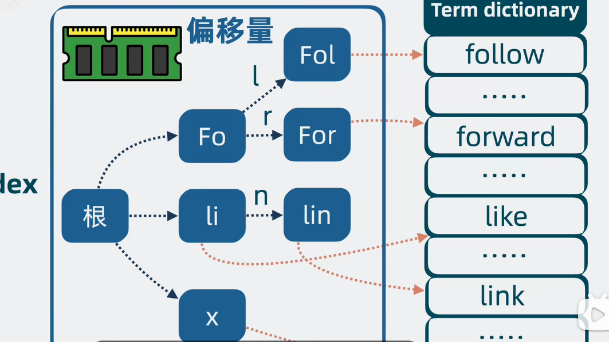
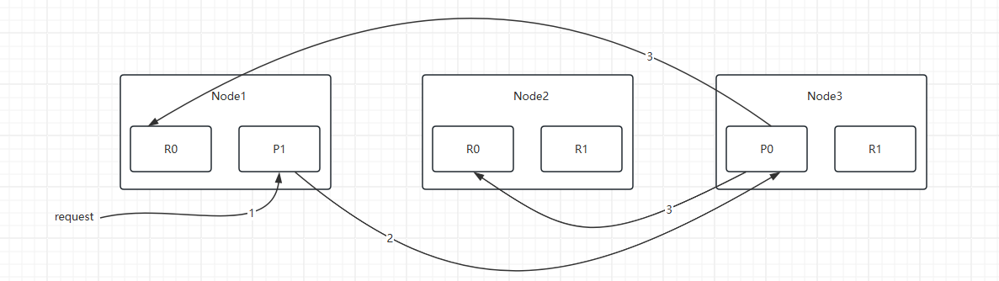

## 1、简介

- Elasticsearch是⼀个基于ApacheLucene库实现的，Restful⻛格的，分布式搜索和数据分析引擎。基 于倒排索引技术，实现了⾼性能的全⽂检索和数据分析功能。[官方网站](https://www.elastic.co/cn/elasticsearch/)

## 2、结构

### 2.1、倒排索引

- 将文本分词后获得词项，建立文本id和词项对应关系，是多对多的关系

  

- 查询时间复杂度O(n)，排序后为O(logn)

#### 2.1.2、存储结构

- 连续存储，根据起始文档Id和命中数量可以快速得到所有文档ID

### 2.2、Term Index（检索关键词）

由于词项太多，放进内存占用会比较大，将词项建立前缀树，叶子结点指向词项在磁盘中的位置，减小了内存的占用、加快搜索速度

### 2.3、Doc Values

- 当要对查询出的数据进行排序时，必须从倒排索引找到文档Id，再从**Sorted Field**拿出文档并根据字段进行排序。
- 为了提升效率，直接建立文档id和排序字段的索引，直接拿到排序后的文档id，这样结构式**Doc Values**

### 2.4、Segment

具备完整搜索能的最小单元，包含Inverted Index、Term Index、Sorted Filed、DocValues

### 2.5、Lucene

- 单机搜索引擎库
- 由于文档会不断添加，防止对同一个Segment读写出现并发问题，规定只能读Segment，新的文档将建立新的Segment
- 搜索时并发读取全部Segment
- 定期进行Segment合并，减少Segment数量

### 2.6、Elastic Search

- 底层使用Lucene的基础上进行高性能、高可用、高扩展性支持持久化的搜索引擎
- 对外提供HTTP接口进行增删改查
- 搜索时分为查询和获取阶段
  - 查询阶段会使用倒排索引和Doc Values获得id
  - 获取阶段再从Sorted Field中获取文档

## 3、分布式

### 3.1、机制

- 分片机制：将完整资源切割成N份存储在不同节点上，解决单个节点的资源限制
- 副本机制：副本位于其他机器上，通过副本可以快速对缺失数据恢复
- 集群发现机制：自动发现集群并加入
- 负载均衡：会对所有分片均衡分配。当新增或减少结点时会自动重新分配

### 3.2、索引过程

默认情况下，集群中的每个结点都是对等的，用户能够发送请求给集群中的任意一个结点。每个结点都知道任意文档所在的结点，所以也可以将请求转发到需要的结点。

- 客户端给Node1 发送建立索引请求
- Node1使用文档ID确定文档属于分片0，转发到Node3上的主分片P0
- Node3在主分片上执行求
- 成功，转发到 位于Node1 和 Node2的相应副本分片上。当所有副本报告成功，Node3返回成功报告

### 3.3、检索过程

- 确定对应分片
- 寻找副本分片

### 3.4、局部更新过程

- 客户端给Node1发送更新请求
- Node3转发请求到主分片Node3
- Node3检索文档，修改字段，重新建立索引，如果有其他进程修改了文档，则重复此步骤
- Node3成功更新文档，同时转发文档的新版本到Node1和Node2上的副本重建索引。所有副本报告成功返回

### 3.5、节点发现和集群形成机制

- 每个节点通过连接到每个地址并试图识别它所连接的节点来探测种子节点地址
- 它与远程节点共享其所有已知的候选节点的列表，并且远程节点依次与其对等响应。然后，结点==节点探测它刚刚发现的所有新节点，并依次请求它们的对等节点
- 列表大于等于2时的第一个节点为主节点

该过程中如果发现选定的主节点，直接加入集群。

未发现选定的主节点或节点为非候选主节点，则进行重试。

发现节点符合主节点条件，继续次发现过程，直到发现选定的主节点，或者发现足够的候选主节点直到选择为止

## 4、参考

- [视频资料](https://www.bilibili.com/video/BV1yb421J7oX?vd_source=1f9ea29590303cada0b4e521e1e038e0)
- Elatsicsearch权威指南 赵建亭著 清华大学出版社

