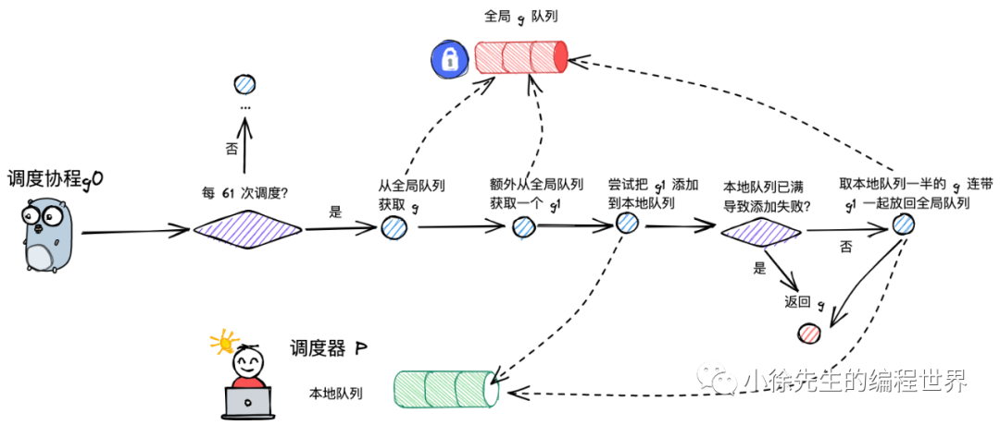

# 一、架构

## GMP模型

gmp = goroutine + machine + processor

### Goroutinue

- 协程：轻量级线程，又称“用户级线程”。创建、销毁、调度在用户态完成，会阻塞同一线程的所有协程

- Golang中的协程，与线程映射关系M：N
- 利用多个线程实现并行
- 有自己的运行栈、状态，栈空间大小动态扩缩
- 需要绑定到p执行

### Processor

- p 即 processor，是 golang 中的调度器，它保存G的上下文信息，并提供给m运行。这样解绑了G和M，保证G可以运行到其他M上
- p 的数量决定了 g 最大并行数量，可由用户通过 GOMAXPROCS （默认为CPU核心数）进行设定

### Machine

- M是线程的抽象
- 调度G前要和P绑定
- **g0**：一类特殊的调度协程，不用于执行用户函数，负责执行 g 之间的切换调度. 与 m 的关系为 1:1
  - m 通过 p 调度执行的 goroutine 永远在普通 g 和 g0 之间进行切换
  - 当 g0 找到可执行的 g 时，会调用 *gogo* 方法，调度 g 执行用户定义的任务
  - 当 g 需要主动让渡或被动调度时，会触发 *mcall* 方法，将执行权重新交还给 g0.

### 三种队列

- p的本地队列：存放p调度的G
- 全局队列：存放还没有调度的G，访问需要加锁
- wait队列：存放IO阻塞就绪的G

### work-stealing机制

当一个p的本地队列为空时，可以窃取其他p的本地队列

### 调度类型

- 主动调度
  - 调用了 runtime.Gosched 方法，此时当前 g 会当让出执行权，主动进行队列等待下次被调度执行
- 被动调度
  - g 可能会陷入阻塞态无法被调度，直到关注的条件达成后，g才从阻塞中被唤醒，重新进入可执行队列等待被调度
  - 底层会走进 gopark 方法（runtime/proc.go）
  - goready 方法通常与 gopark 方法成对出现，能够将 g 从阻塞态中恢复，重新进入等待执行的状态
- 正常调度
  - g 中的执行任务已完成，g0 会将当前 g 置为死亡状态，发起新一轮调度
- 抢占调度
  - g 执行系统调用超过指定的时长，此时将 p 和 g 解绑，用于其他 g 的调度. 等 g 完成系统调用后，会重新进入可执行队列中等待被调度
  - 前三种有go调度，但抢占调度由全局监控协程 **monitor g 来进行，这个 g 直接与一个 m 进行绑定**，不断轮询对所有 p 的执行状况进行监控. 倘若发现满足抢占调度的条件，则会从第三方的角度出手干预

### 调度流程

1. 全局流程

   - 以 g0 -> g -> g0 的一轮循环为例进行串联
   - g0 执行 schedule() 函数，寻找到用于执行的 g，并执行g
   - g0 执行 execute() 方法，更新当前 g、p 的状态信息，并调用 gogo() 方法，将执行权交给 g
   - g 因主动让渡( gosche_m() )、被动调度( park_m() )、正常结束( goexit0() )等原因，调用 m_call 函数，执行权重新回到 g0 手中
   - g0 执行 schedule() 函数，开启新一轮循环

2. findRunnable

   p的调度流程，由于work-stealing机制p对本地队列操作需要加锁

   

   - 每执行 61 次调度，会从全局队列中获取一个 goroutine 进行执
   - 还会额外将一个 g 从全局队列转移到 p 的本地队列，让全局队列中的 g 也得到更充分的执行机会
   - 本地队列已满，则会返回来将本地队列中一半的 g 放回全局队列中，帮助当前 p 缓解执行压力

3. execute

   - 更新 g 的状态信息，建立 g 与 m 之间的绑定关系
   - 更新 p 的总调度次数
   - 调用 gogo 方法，执行 goroutine 中的任务

4. gosched_m

   当前g主动调用mcall将执行权让给g0，g0调用gosched_m方法

   - 将g的状态更新为RUNABLE
   - 解绑 g 和 m，并将g添加到全局队列（加锁）
   - 开始新一轮调度，schedule()

5. park_m

   g 需要被动调度时，会调用 mcall 方法切换至 g0，并调用 park_m 方法将 g 置为阻塞态

   - 将当前 g 的状态由 running 改为 waiting
   - 将 g 与 m 解绑
   - 执行新一轮的调度 schedule

6. goready

   当因被动调度陷入阻塞态的 g 需要被唤醒时，会由其他协程执行 goready 方法将 g 重新置为可执行的状态

   - 先将 g 的状态从waiting改为RUNABLE
   - 加入到唤醒者p的本地队列，满了移动到全局队列

7. goexit0

   当 g 执行完成时，会先执行 mcall 方法切换至 g0，然后调用 goexit0 方法

   - 将g的状态设置为dead
   - 解绑g和m，开启新一轮调度

### 参考

- [Golang GMP 原理 (qq.com)](https://mp.weixin.qq.com/s/jIWe3nMP6yiuXeBQgmePDg)

## 内存模型

## 垃圾回收

### 三色标记法

- 对象分为三种颜色标记：黑、灰、白
- 黑对象代表，对象自身存活，且其指向对象都已标记完成
- 灰对象代表，对象自身存活，但其指向对象还未标记完成
- 白对象代表，对象尙未被标记到，可能是垃圾对象
- 标记开始前，将根对象（全局对象、栈上局部变量等）置黑，将其所指向的对象置灰
- 从灰对象出发，将其所指向的对象都置灰. 所有指向对象都置灰后，当前灰对象置黑
- 标记结束后，白色对象就是不可达的垃圾对象，需要进行清扫.

### 存在问题

#### 并发标记问题

1. 漏标，置黑的对象在标记期间引用了其他对象，导致该对象没有置灰
2. 错标，标记期间置黑或置灰的对象被上游对象解除了引用（可以接受，至多存活到下一轮GC）

- 解决

  漏标问题的本质就是，一个已经扫描完成的黑对象指向了一个被灰\白对象删除引用的白色对象

  1. 黑色对象指向了白色对象
  2. 灰、白对象删除了白色对象
  3. （1）、（2）步中谈及的白色对象是同一个对象
  4. （1）发生在（2）之前

  强弱三色不变式

  - 强三色不变式：白色对象不能被黑色对象直接引用（直接破坏（1））
  - 弱三色不变式：白色对象可以被黑色对象引用，但要从某个灰对象出发仍然可达该白对象（间接破坏了（1）、（2）的联动）

#### 碎片问题

Golang采用 TCMalloc 机制，依据对象的大小将其归属为到事先划分好的spanClass当中，这样能够消解外部碎片的问题，将问题限制在相对可控的内部碎片当中。基于此，Golang选择采用实现上更为简单的标记清扫算法

### 屏障机制

屏障机制类似于一个回调保护机制，指的是在完成某个特定动作前，会先完成屏障成设置的内容。屏障机制无法作用于栈对象。

#### 插入写屏障

实现强三色不变式

- 证当一个黑色对象指向一个白色对象前，会先触发屏障将白色对象置为灰色，再建立引用
- 步骤（1）被破坏使得黑色对象不能指向白色对象

#### 删除写屏障

实现弱三色不变式

- 当一个白色对象即将被上游删除引用前，会触发屏障将其置灰，之后再删除上游指向其的引用
- 步骤（2）会被破坏，漏标问题得以解决

#### 混合写屏障

​	由于栈对象可能涉及频繁的轻量操作，倘若这些高频度操作都需要一一触发屏障机制，那么所带来的成本将是无法接受的。

​	引入额外的Stop the world（STW）阶段，对栈对象的处理进行兜底。为了消除这个额外的 STW 成本，Golang 1.8 引入了混合写屏障机制

-  GC 开始前，以栈为单位分批扫描，将栈中所有对象置黑
- GC 期间，栈上新创建对象直接置黑
- 堆对象正常启用插入写屏障和删除写屏障

### GC流程

- GC触发
- 标记准备
- 并发标记
- 标记清扫

# 二、内置对象底层原理

## slice

### 三个属性

- array unsafe.Pointer ，指向内存空间的首地址
- len int
- cap int

### 截取

​	len(s) = 10，cap(s) = 12

1. s1 = s[8:]，len(s1) = 2，cap(s1) = 4
2. s2 = s[:2]，len(s2) = 2，cap(s2) = 12

### 扩容策略

1. 预期容量小于原容量，panic
2. 切片元素大小为0，直接复用一个全局的 zerobase 实例，直接返回
3. 预期容量超过老容量两倍，直接采用预期容量
4. 老容量小于256，直接采用老容量的2倍
5. 老容量大于256，则在老容量基础上扩容1/4，并且加上 256 * 3 / 4 = 192的数值，直到老容量大于等于预期容量
6. 计算预期空间大小 = 新容量 * 元素大小，根据mspan等级制度得到空间大小，才能得到实际新容量

### 参考

- https://mp.weixin.qq.com/s/uNajVcWr4mZpof1eNemfmQ

## context

### 属性

```go
type Context interface{
    Deadline() (deadline time.Time, ok bool) //返回ctx的过期时间
    Done() <-chan struct{} // 返回标识ctx结束的chan
    Err() error // 返回ctx错误
    Value(key any) any //键值对 key-value
}
```

### emptyCtx

```go
type emptyCtx int

func (*emptyCtx) Deadline() (deadline time.Time, ok bool) {
	return
}

func (*emptyCtx) Done() <-chan struct{} {
	return nil
}

func (*emptyCtx) Err() error {
	return nil
}

func (*emptyCtx) Value(key any) any {
	return nil
}
```

context.Background() 和 context.TODO(）返回*emptyCtx

### cancelCtx

```go
type cancelCtx struct {
	Context                        // 父级ctx

	mu       sync.Mutex            // 协调并发场景下的资源获取
    done     atomic.Value          // 标识ctx是否结束，存储chan struct{}
	children map[canceler]struct{} // 子ctx的集合
	err      error                 // 
	cause    error                 //
}

type canceler interface {
	cancel(removeFromParent bool, err, cause error)
	Done() <-chan struct{}
}
```

- context.WithCancel(parent Context) (ctx Context, cancel CancelFunc)
  - 构造canceler
  - 开启守护进程，保证父终止后子也终止
- cancelCtx.cancel(removeFromParent bool, err error) 
  - 加锁校验cancelCtx的err是否为nil，不为nil说明已经返回，直接解锁返回；为nil，将err赋给cancelCtx的err
  - 处理cnacelCtx的chan，已经初始化则close，否则注入closedChan
  - 处理子context，一次cancel
  - 根据removeFromParent判断是否从父context中移除该cancelCtx

### timerCtx

```go
type timerCtx struct {
	cancelCtx 			// 继承cancelCtx
	timer *time.Timer   // 过期时间终止

	deadline time.Time // 过期时间
}
```

- Deadline() (deadline time.Time, ok bool)：context.Context interface 下的 Deadline api 仅在 timerCtx 中有效，由于展示其过期时间

- timerCtx.cancel(removeFromParent bool, err error) 

  - 判断是否需要手动从 parent 的 children set 中移除，若是则进行处理
  - 加锁，停止 time.Timer，解锁返回

- context.WithDeadline(parent Context, d time.Time) (Context, CancelFunc)

  - 校验 parent 的过期时间是否早于自己，若是，则构造一个 cancelCtx 返回即可
  - 构造出一个新的 timerCtx， 启动守护方法，同步 parent 的 cancel 事件到子 context
  - 判断过期时间是否已到，若是，直接 cancel timerCtx，并返回DeadlineExceeded 的错误

  - 加锁，启动 time.Timer，设定一个延时时间，即达到过期时间后会终止该 timerCtx（使用time.AfterFunc），并返回 DeadlineExceeded 的错误，解锁
  - 返回 timerCtx，已经一个封装了 cancel 逻辑的闭包 cancel 函数.

### valueCtx

```go
type valueCtx struct {
	Context
	key, val any
}

func (c *valueCtx) Value(key any) any {
    // 假如当前 valueCtx 的 key 等于用户传入的 key，则直接返回其 value
    if c.key == key {
        return c.val
    }
    // 假如不等，则从 parent context 中依次向上寻找
    return value(c.Context, key)
}
```

- value(c Context, key any) any

  - 启动一个 for 循环，由下而上，由子及父，依次对 key 进行匹配
  - 中 cancelCtx、timerCtx、emptyCtx 类型会有特殊的处理方式
  - 找到匹配的 key，则将该组 value 进行返回

- WithValue(parent Context, key, val any) Context 

  - parent context 为空，key 为空，key 的类型不可比较，panic

  - 包括 parent context 以及 kv对，返回一个新的 valueCtx

### 参考

- [Golang context 实现原理](https://mp.weixin.qq.com/s/AavRL-xezwsiQLQ1OpLKmA)

## chan

### 属性

```go
type hchan struct {
	qcount   uint           // 存在元素数量
	dataqsiz uint           // chan元素容量
	buf      unsafe.Pointer // 数组首地址
	elemsize uint16 // 元素大小
	closed   uint32	// 标识是否关闭
	elemtype *_type // 元素类型
	sendx    uint   // 发送元素的索引
	recvx    uint   // 接收元素索引
	recvq    waitq  // 读协程队列
	sendq    waitq  // 写协程队列
	lock mutex		// 锁
}

type waitq struct {
	first *sudog // 队列头部
	last  *sudog // 队列尾部
}

type sudog struct {
	g *g				// 协程
	next *sudog			// 队列中的下一个节点
	prev *sudog			// 队列中的前一个节点
	elem unsafe.Pointer // 读取/写入 channel 的数据的容器
	acquiretime int64
	releasetime int64
	ticket      uint32	// 票据，用于实现公平的等待队列调度
	isSelect bool 		// 标识当前协程是否处在 select 多路复用的流程中
	success bool		// 标记通道通信是否成功。如果 goroutine 因为接收到数据而被唤醒，则为 true；如果因为通道关闭而被唤醒，则为 false
	parent   *sudog 	// semaRoot binary tree
	waitlink *sudog 	// g.waiting list or semaRoot
	waittail *sudog 	// semaRoot
	c        *hchan 	// 标识与当前 sudog 交互的 chan
}
```

### 异常情况

1. 对于未初始化的 chan，写入操作会引发死锁
2.  对于已关闭的 chan，写入操作会引发 panic

### 写流程（chansend ）

- #### 写时存在阻塞读协程（直接绕过缓冲区）

  - 加锁，从阻塞队列取出sudog元素
  - 在 send 方法中，会基于 memmove 方法，直接将元素拷贝交给 sudog 对应的 goroutine
  - 在 send 方法中会完成解锁动作

- #### 写时无阻塞读协程但环形缓冲区仍有空间

  - 加锁，将当前元素添加到环形缓冲区 sendx 对应的位置
  - sendx++，qcount++，解锁，返回

- #### 写时无阻塞读协程且环形缓冲区无空间

  - 加锁
  - 构造封装当前 goroutine 的 sudog 对象， 完成指针指向，建立 sudog、goroutine、channel 之间的指向关系
  - 把 sudog 添加到当前 channel 的阻塞写协程队列中
  - park 当前协程
  - 若协程从 park 中被唤醒，则回收 sudog
  - 解锁，返回

### 读流程（chanrecv）

- #### 读空 channel（c == nil）

  - park 挂起，引起死锁

- #### channel 已关闭且内部无元素

  - 直接解锁返回

- #### 读时有阻塞的写协程

  - 加锁
  - 从阻塞写协程队列获取写协程
  - 若channel无缓冲区，直接读取写协程元素，唤醒写协程
  - 若channel有缓冲区，读取缓冲区头部元素，并将写协程元素写入缓冲区尾部，唤醒协程
  - 解锁返回

- #### 读时无阻塞写协程且缓冲区有元素

  - 加锁
  - 获取到 recvx 对应位置的元素
  -  recvx++，qcount--，解锁，返回

- #### 读时无阻塞写协程且缓冲区无元素

  - 加锁
  - 构造封装当前 goroutine 的 sudog 对象， 完成指针指向，建立 sudog、goroutine、channel 之间的指向关系
  - 把 sudog 添加到当前 channel 的阻塞读协程队列中
  - park 当前协程
  - 若协程从 park 中被唤醒，则回收 sudog
  - 解锁，返回

### 非阻塞模式

只有在select多路复用的模式中才会进入非阻塞模式

```go
func selectnbsend(c *hchan, elem unsafe.Pointer) (selected bool) {
    return chansend(c, elem, false, getcallerpc())
}

func selectnbrecv(elem unsafe.Pointer, c *hchan) (selected, received bool) {
    return chanrecv(c, elem, false) // false表示非阻塞模式
}
```

### 读取channel方法

```go
ch := make(chan int, 2)
got1 := <- ch
got2,ok := <- ch
```

被编译成两种方法

```go
func chanrecv1(c *hchan, elem unsafe.Pointer) {
    chanrecv(c, elem, true)
}

func chanrecv2(c *hchan, elem unsafe.Pointer) (received bool) {
    _, received = chanrecv(c, elem, true)
    return
}
```

### 关闭channel

- 检查channel是否为nil
- 加锁
- 将读协程加入glist
- 将写协程加入glist
- 解锁
- 唤醒glist索引协程（goready）

### 参考

- [Golang channel 实现原理](https://mp.weixin.qq.com/s/QgNndPgN1kqxWh-ijSofkw)

## WaitGroup

### 结构

- ncopy 防拷贝标志，只能引用使用
- state1 uint64 高32位表示计数器数值，第32位表示wait阻塞方法数量
- state2 uint64 阻塞/唤醒goroutinue的信号量

### Add

- 调用 atomic.AddUint64，直接通过指针的方式直接在 WaitGroup.state1 的高 32 位基础上累加上 delta 的值
- 执行完 Add 操作后，WaitGroup 的计数器还是正值，则直接返回
- 若本次 Add 操作后， WaitGroup 计数器被清零了，则需要把 Wait 操作而陷入阻塞的 goroutine 唤醒. 在这期间，不允许再并发执行 Add 操作，否则会 panic
- 唤醒 goroutine 使用的方法是 runtime_Semrelease 方法，底层会执行 goready 操作，属于 goroutine 的被动调度模式

### Done

- WaitGroup.Add(-1)

### Wait

- for 循环开启**自旋**流程
- 若计数器数值 已经是 0 了，则无需阻塞 goroutine，直接返回即可
- 若计数器数值 大于 0，代表当前 goroutine 需要被阻塞挂起
- 基于 cas，将 state1 低 32 位的数值加 1
- 调用 runtime_Semacquire 方法，内部会通过 go park 操作，将当前 goroutine 阻塞挂起，属于被动调度模式
- 当 goroutine 从 runtime_Semacquire 方法走出来时，说明 WaitGroup 计数器已经被清零了

### 参考

- [Golang WaitGroup 实现原理](https://mp.weixin.qq.com/s/jIWe3nMP6yiuXeBQgmePDg)

## map

map 又称为 hash map，在算法上基于 hash 实现 key 的映射和寻址；在数据结构上基于桶数组实现 key-value 对的存储.

以一组 key-value 对写入 map 的流程为例进行简述：

（1）通过哈希方法取得 key 的 hash 值；

（2）hash 值对桶数组长度取模，确定其所属的桶；

（3）在桶中插入 key-value 对.

### 桶数组

1. 桶的数量为2 的整数幂
2. 每个桶固定存放8个 key - value 对
3. 超过8个创建链表，每个结点是一个桶

### 冲突解决

结合拉链法和开放寻址法

1. 当 key 命中一个桶时，首先根据开放寻址法，在桶的 8 个位置中寻找空位进行插入
2. 倘若桶的 8 个位置都已被占满，则基于桶的溢出桶指针，找到下一个桶
3. 倘若遍历到链表尾部，仍未找到空位，则基于拉链法，在桶链表尾部续接新桶

### 扩容

1. 当桶内 key-value 总数/桶数组长度 > 6.5 时发生增量扩容，桶数组长度增长为原值的两倍
2. 当桶内溢出桶数量大于等于 2^B 时( B 为桶数组长度的指数，B 最大取 15)，发生等量扩容，桶的长度保持为原值，但是溢出桶的数量会下降
3. 采用渐进扩容的方式，当桶被实际操作到时，由使用者负责完成数据迁移

### 数据结构

```go
type hmap struct {
	count     int 					// map 中的 key-value 总数；
	flags     uint8 				//map 状态标识，可以标识出 map 是否被 goroutine 并发读写
	B         uint8  				// 桶数组长度的指数，桶数组长度为 2^B
	noverflow uint16 				// map 中溢出桶的数量 
	hash0     uint32 				// hash 随机因子，生成 key 的 hash 值时会使用到
	buckets    unsafe.Pointer 		// 桶数组
	oldbuckets unsafe.Pointer 		// 扩容过程中老的桶数组
	nevacuate  uintptr        		// 扩容过程中老的桶数组
	extra *mapextra 				// 预申请的溢出桶
}
```

#### mapextra

```go
type mapextra struct {
	overflow    *[]*bmap //供桶数组 buckets 使用的溢出桶
	oldoverflow *[]*bmap //  扩容流程中，供老桶数组 oldBuckets 使用的溢出桶
	nextOverflow *bmap // 下一个可用的溢出桶
}
```

#### bmap

```go
type bmap struct {
	tophash [bucketCnt]uint8
}
```

#### 读流程

（1）根据 key 取 hash 值；

（2）根据 hash 值对桶数组取模，确定所在的桶；

（3）沿着桶链表依次遍历各个桶内的 key-value 对；

（4）命中相同的 key，则返回 value；倘若 key 不存在，则返回零值.

#### 写流程

（1）根据 key 取 hash 值；

（2）根据 hash 值对桶数组取模，确定所在的桶；

（3）倘若 map 处于扩容，则迁移命中的桶，帮助推进渐进式扩容；

（4）沿着桶链表依次遍历各个桶内的 key-value 对；

（5）倘若命中相同的 key，则对 value 中进行更新；

（6）倘若 key 不存在，则插入 key-value 对；

（7）倘若发现 map 达成扩容条件，则会开启扩容模式，并重新返回第（2）步.

## sync.map

```go
type Map struct {
	mu Mutex // 互斥锁
	read atomic.Pointer[readOnly] // 只读map
	dirty map[any]*entry
	misses int // 只读map miss次数
}

type readOnly struct {
	m       map[any]*entry
	amended bool // 标识是否缺失数据
}

type entry struct {
    p unsafe.Pointer 
}
// entry.p 的指向分为三种情况：
//I 存活态：正常指向元素；
//II 软删除态：指向 nil；
//III 硬删除态：指向固定的全局变量 expunged.
```

- 首先基于无锁操作访问 read map；倘若 read map 不存在该 key，则加锁并使用 dirty map 兜底

- read map 和 dirty map 之间会交替轮换更新.

### 读流程

- 查看 read map 中是否存在 key-entry 对，若存在，则直接读取 entry 返回；
- 倘若第一轮 read map 查询 miss，且 read map 不全，则需要加锁 double check；

- 第二轮 read map 查询仍 miss（加锁后），且 read map 不全，则查询 dirty map 兜底；
- 查询操作涉及到与 dirty map 的交互，misses 加一；
-  解锁，返回查得的结果.

### 写流程

- 若read map存在key且entry状态不为expunged，基于CAS更新
- double check，若read map 或dirty map存在k-e对，直接更新
- 若上一步read map中发现k-e对为expunghed，需要在dirty map恢复
- 若 read map 和 dirty map 均不存在，则在 dirty map 中插入新 key-entry 对，并且保证 read map 的 amended flag 为 true.（插入）
- 解锁返回

### 删流程

- 若 read map 中存在 key，则直接基于 cas 操作将其删除
- 若read map 不存在 key，且 read map 有缺失（amended flag 为 true），则加锁 dou check
- 加锁 double check 时，read map 仍不存在 key 且 read map 有缺失，则从 dirty map 中取元素，并且将 key-entry 对从 dirty map 中物理删除
- 倘若从 read map 或 dirty map 中获取到了 key 对应的 entry，则走入 entry.delete() 方法逻辑删除 entry
- 倘若 read map 和 dirty map 中均不存在 key，返回 false 标识删除失

## sync.Cond

```go
type Cond struct {
	noCopy noCopy // 防止复制
	L Locker	  // 锁
	notify  notifyList // 需要唤醒的阻塞队列
	checker copyChecker// 防止复制
}

type notifyList struct {
	wait   uint32 //调用 Cond.Wait() 方法的次数
	notify uint32 //goroutine 被唤醒的次数
	lock   uintptr // key field of the mutex
	head   unsafe.Pointer //链表的头尾节点
	tail   unsafe.Pointer
}
```

### Cond.Wait

```go
func (c *Cond) Wait() {
	c.checker.check() //检查 Cond 是否在使用过后被拷贝，是则 panic
	t := runtime_notifyListAdd(&c.notify) //阻塞链表 wait 统计数加 1
	c.L.Unlock() //当前协程释放锁，因为接下来即将被操作系统 park
	runtime_notifyListWait(&c.notify, t) //将当前协程包装成节点，添加到 Cond 的阻塞队列当中，并调用 park 操作将当前协程挂起
	c.L.Lock() //协程被唤醒后，重新尝试获取锁
}
```

### Cond.Signal

```go
func (c *Cond) Signal() {
	c.checker.check()//检查 Cond 是否在使用过后被拷贝，是则 panic
	runtime_notifyListNotifyOne(&c.notify) //该 Cond 阻塞链表 notify 统计数加 1;从头开始遍历阻塞链表，唤醒一个等待时间最长的 goroutine
}
```

### Cond.Broadcast

```go
func (c *Cond) Broadcast() {
	c.checker.check()
	runtime_notifyListNotifyAll(&c.notify) //  取 wait 值赋值给 notify;唤醒阻塞链表所有节点
}
```

## sync.Pool

```go
type Pool struct {
	noCopy noCopy // 防拷贝标志
	local     unsafe.Pointer // [P]poolLocal 的数组，P为process个数
	localSize uintptr
	victim     unsafe.Pointer // 经过一轮 gc 回收，暂存的上一轮 local
	victimSize uintptr      
	New func() any			// 用户指定的工厂函数
}

// Local per-P Pool appendix.
type poolLocalInternal struct {
	private any       // 对应于某个 P 的私有元素，操作时无需加锁
	shared  poolChain //某个 P 下的共享元素链表，由于各 P 都有可能访问，因此需要加锁
}

//  poolLocal 为 Pool 中对应于某个 P 的缓存数据
type poolLocal struct {
	poolLocalInternal
	pad [128 - unsafe.Sizeof(poolLocalInternal{})%128]byte
}
```

### Pool.pin

```go
func (p *Pool) pin() (*poolLocal, int) {
	pid := runtime_procPin()
	s := runtime_LoadAcquintptr(&p.localSize) // load-acquire
	l := p.local                              // load-consume
	if uintptr(pid) < s {
		return indexLocal(l, pid), pid
	}
	return p.pinSlow()
}
```

- pin 方法内部通过 native 方法 runtime_procPin 取出当前 P 的 index，并且将当前 goroutine 与 P 进行绑定，短暂处于不可抢占状态；
- 如果是首次调用 pin 方法，则会走进 pinSlow 方法；
- 在pinSlow 方法中，会完成 Pool.local 的初始化，并且将当前 Pool 添加到全局的 allPool 数组中，用于 gc 回收

### Pool.Get

```go
func (p *Pool) Get() any {
	if race.Enabled {
		race.Disable()
	}
	l, pid := p.pin() 	 //绑定当前 goroutine 与 P
	x := l.private  	//获取 P 缓存数据的私有元素 private
	l.private = nil
	if x == nil {
		x, _ = l.shared.popHead() //尝试取 P 缓存数据中共享元素链表的头元素
		if x == nil {
			x = p.getSlow(pid) //试取其他 P 缓存数据中共享元素链表的尾元素;在 Pool.getSlow 方法中，倘若前一步失败，则尝试从上轮 gc 前缓存中取元素（victim）
		}
	}
	runtime_procUnpin() // 解绑 当前 goroutine 与 P
	if race.Enabled {
		race.Enable()
		if x != nil {
			race.Acquire(poolRaceAddr(x))
		}
	}
	if x == nil && p.New != nil {
		x = p.New() // 没能获取到p的私有元素或共享元素，调用构造方法返回
	}
	return x
}
```

### Pool.Put

```go
func (p *Pool) Put(x any) {
	if x == nil {
		return
	}
	if race.Enabled {
		if fastrandn(4) == 0 {
			// Randomly drop x on floor.
			return
		}
		race.ReleaseMerge(poolRaceAddr(x))
		race.Disable()
	}
	l, _ := p.pin()
	if l.private == nil {
		l.private = x
	} else {
		l.shared.pushHead(x)
	}
	runtime_procUnpin()
	if race.Enabled {
		race.Enable()
	}
}
```

- 判断存入元素 x 非空
- 调用 Pool.pin 绑定当前 goroutine 与 P，并获取 P 的缓存数据
- P 缓存数据中的私有元素为空，则将 x 置为其私有元素
- P 缓存数据中的私有元素不为空，则将 x 添加到 P 缓存数据共享链表的末尾
- 解绑当前 goroutine 与 P

### 小结

1. 初始化pool，拥有一个len(p)的数组，每个数组有缓存数据
2. get和put时先获取g的pid，定位到数组
3. 操作对应数组的链表

### 回收机制

存入 pool 的对象会不定期被 go 运行时回收，因此 pool 没有容量概念，即便大量存入元素，也不会发生内存泄露

- 每次 gc 时，会将上一轮的 oldPools 清空，并将本轮 allPools 的元素赋给 oldPools，allPools 置空；
- 新置入 oldPools 的元素统一将 local 转移到 victim，并且将 local 置为空
- 每个 Pool 首次执行 Get 方法时，会在内部首次调用 pinSlow 方法内将该 pool 添加到迁居的 allPools 数组中

### 参考

- [Golang 协程池](https://mp.weixin.qq.com/s/Uctu_uKHk5oY0EtSZGUvsA)

## HTTP

## EPOLL

# 三、框架

## Gin
