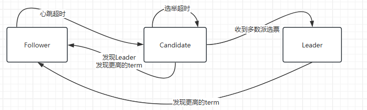

# 1、基本概念

Raft涉及的关键术语分为3个方面，即成员状态、运行阶段和RPC消息

## 1.1、多数派

多数派接收某一个日志项，即意味着整个集群接收该日志项

## 1.2、任期

Raft将任期分割为不同长度的任期，记作term。term使用连续的整数进行单数递增，并随着RPC消息在成员间交换。

Raft使用term作为Leader的任期号并遵循以下规则：

- 每个Raft成员在本地维护自己的term
- 在每轮Leader选举之前递增自己本地的term
- 每个RPC消息都携带自己本地的term
- 每个Raft成员拒绝处理小于自己本地term的RPC消息

如果一个Candidate或者Leader发现自己额term小于接收消息中的term，则会立即回到Follower状态

Raft允许新旧多个Leader同时存在，需要通过term拒绝哪些过期的Leader

## 1.3、成员状态

### Follower

- 只会处理和响应来自Leader和Candidate的请求。如果一个客户端和Follower通信，Follower会将请求重定向给Leader。
- 数据以Leader为准，被动接收

### Candidate

- 如果Leader出现故障或者Follower等待心跳超时，则Follower会变更为Candidate
- 新的Leader只会从Candidate中产生

### Leader

- 当某个Candidate获得多数派选票时，该成员晋升为Leader负责处理接下来的客户端请求、日志复制和心跳消息管理

### 无投票成员

- 新成员上线时的的身份，在不影响集群情况下快速和Leader进行数据对齐。

### Witness

- 只投票不存储数据放入成员对资源需求小

## 1.4、运行阶段

### Leader选举

集群启动之初或Leader出现故障时，需要选出一个新Leader接替上一任Leader工作

### 日志复制

Leader可以接受客户端请求并进行正常处理，有Leader向Folloer同步日志项

## 1.5、RPC消息

RPC消息分为四种，前两种事Raft基础功能的实现，后两种是为了优化Raft引入的

- RequstVote：请求投票信息
- AppendEntries：追加条目信息。用于一下场景
  - Leader用该消息向Folloer执行日志复制
  - Leader与Follower之间的心跳检测
  - Leader与Follower之间的日志对齐
- InstallSnapshot：快照传输消息
- TimeoutNow：快速超时消息，用于Leader切换，可立即发起Leader选举

# 2、算法描述

## 2.1、Leader选举

### 2.1.1、选举进程

- Follower在等待一个超时后进入Candidate状态，然后发起Leader选举并通过RequestVote消息广播自己的选票（包含最新日志索引和任期term）
- 当发生以下情况退出Candidate状态
  - 自己获得多数派选票赢得本次选举，进入Leader状态
  - 其它成员获得多数派选票，进入Follower状态
  - 在一段时间内，灭有任何成员获得多数派选票
- 采用先来先服务规则
  - 当成员A收到B和C同一任期的选票，且成员B的选票先到，则在该任期内A会将选票投给成员B
- 当一个Candidatee当选时，进入Leader状态会周期向所有Follower发起心跳消息（AppendEntries消息），防止Follower发起新的选举
- 当一个Candidate在等待选票过程中收到AppendEntries消息。且任期大于等于自己任期时，进入Follower状态
  - 如果小于自己任期，拒绝该消息继续选举

### 2.1.2、分割选举

多个Candidate发起选举，选票被瓜分

#### 双重等待机制

- 随机等待心跳超时：降低多个成员同时发起选举的可能性
- 随机等待选票超时：控制同时发起选举的成员数量

### 2.1.3、投票规则

Raft试图保证在选举阶段新晋升的Leader一定拥有之前提交的所有日志

- 任期长的成员拒绝给任期短的成员投票
- 最后一条日志项编号大成员拒绝给日志项小的成员投票
- 每个成员任期内只能都出一张票，先来先服务

## 2.2、日志复制

### 2.2.1、日志项

- 日志是一个无限长的列表，每个元素是一个日志项。日志项保存事务操作、term和日志索引
- Raft日志必须是连续的，不允许出现空洞

### 2.2.2、日志复制

Leader与Follower交互步骤

- Leader首先以日志项的形式将事务追加到本地日志
- Leader并行地通过AppendEndtries消息将日志广播给Follower
- Follower按照AppendEndtries消息将日志追加至本地日志
- Follower将执行结果发送给Leader
- Leader收到多数派的Follower成功响应就立即提交日志
- Leaer将执行结果返回给客户端

Follower接受条件

- 接收某个日志项前检查是否已经拥有前一个日志项

### 2.2.3、日志提交

Leader发送心跳AE消息或下一个日志协商AE的消息通知Follower提交日志

#### committedIndex

已经达成共识的日志索引，Leader在与Follower交互中携带这个变量，在Follower中系哦小于或等于该变量的日志均可提交

## 2.3、日志对齐

当Follower追随Leader之初或落后于Leader数据时，需将Leader的日志复制到其他Follower

### nextIndex

代表当前Follower与Leader日志项相同的下一个索引。Leader会为每个Follower单独设置nextIndex，初始值为lastLogIndex+1(本地日志最后一个索引项)

### 探测日志差异

- Leader以AE的形式发送消息，携带preLogIndex、preLogTerm，其中preLogIndex=nextIndex-1

- Follower收到探测消息后，比对本地的preLogIndex、preLogTerm，将结果反馈给Leader

- Leader收到探测消息后，如果不一致，递减nextIndex发起新一轮探测，直到找到对应的nextIndex

### 优化

- Follower在探测消息中携带lastLogIndex，Leader收到响应后，无须单调递减nextIndex，而是将其赋值为lastLogIndex+1。因此在下一轮可以直接找到对应的nextIndex
  - 若未找到。则是Follower当过Leader并有已提出日志，与当前Leader冲突，只能单调递减寻找nextIndex

- 快照同步。如果落后数据较多。Leader已经生成数据快照且删除日志了，则需要发送快照文件，以快照文件的logIndex+1作为nextIndex

## 2.4、幽灵日志
1. 在Leader将日志持久化到本地宕机，其他节点当选Leader后同样在持久化后宕机。
2. 前一个Leader恢复，协商并提交日志，又宕机
3. 后一个Leader恢复，协商提交日志

### 解决方法
- 新的Leader晋升后，会以当前term提出一个Noop日志项并协商，获得多数派写入后，提交上一任Leader提出的日志项

## 2.5、安全性

1. 选举安全性：一个任期内只有一个Leader
2. 日志匹配：对于两个索引相同，term相同的日志项，必然拥有相同的内容
3. Leader完整性：如果一个日志项被提交，那么该日志项必然存在于后续任期较高的Leader中
4. 状态机安全性：如果一个成员已经应用了一条日志项在状态机中，那么其他成员不会向状态机应用相同索引下的不同日志项

# 3、成员变更

集群成员的变更，自然导致多数派的数量会随之变化。处理不当可能导致两个“多数派”之间不相交，进而使得一个日志索引上会提交两个不同的日志。

## 3.1、联合共识

联合共识是指引入一个临时的“多数派”来保证算法的安全性。7为了在任何时候都能提供完整服务，引入的一个中间状态

### 3.1.1、变更过程

两阶段完成

1. 将 $C_{old,new}$配置发送给$C_{old}$∪$C_{new}$的成员，获得多数派$Q_{old}$∪$Q_{new}$的支持即执行第二阶段
2. 将$C_{new}$的配置发送给$C_{old}$∪$C_{new}$全体成员，但只需获得$Q_{new}$支持完成成员变更

变更过程中，一旦完成第一阶段即处于联合共识状态，对于任何操作$C_{old}$和$C_{new}$都不能单方面做决定

联合共识期间处理事务请求要保证：
- 将日志项分别发送给$C_{old}$和$C_{old,new}$配置的所有成员
- 当提交一个日志项时，要求得到$Q_{old}$和$Q_{new}$两个多数派支持
- 拥有任意一种配置的成员都可以晋升为Leader

### 3.1.2、异常恢复

成员变更过程中Leader崩溃，需要选举Leader

- 拥有$C_{old}$配置的成员晋升Leader时，需要获得$Q_{old}$的支持
- 拥有$C_{new}$配置的成员晋升Leader时，需要获得$Q_{new}$的支持
- 拥有$C_{old,new}$配置的成员晋升Leader时，需要获得$Q_{old}$∪$Q_{new}$的支持

1. 如果拥有$C_{old}$配置的成员晋升为Leader后并不知道当前是否处于成员变更过程中，那么本次成员变更只能以失败告终，但可以继续运行
2. 如果$C_{new}$配置的成员晋升为Leader，则意味着成员已经完成了第一阶段的工作并获得了$Q_{new}$的支持。之后Leader会将$C_{new}$复制到其他成员中完成第二阶段
3. 如果$C_{old,new}$配置的成员晋升为Leader，意味着成员已经完成了第一阶段的工作并获得了$Q_{old}$∪$Q_{new}$的支持。无论第二阶段处于哪个状态，Leader都可以再完成一次第二阶段的协商

### 3.1.3、脑裂

成员配置以日志项的形式存储，对于$C_{old,new}$和$C_{new}$达成共识的方式，可以以日志复制的形式协商

## 3.2、工程实践

### 3.2.1、新成员上线

#### 问题

- 新成员加入无法决策Leader提出的新日志项，如果作为多数派的一员会阻断Raft协商过程
- 在旧成员全部下线后可能获取不到已提交的提案

为了避免这类情况，在成员变更前，让新成员尽快赶上Leader的日志，但是不参与决策，即无投票成员

### 3.2.2、成员配置生效

任何成员在提交$C_{new}$时，如果发现自己不在配置中，就应该主动关闭自己

#### Leader

1. 第一阶段，收到成员变更请求后应用$C_{old,new}$
2. 第二阶段开始应用$C_{new}$

#### Follower

1. 第一阶段，收到$C_{old,new}$后应用$C_{old,new}$
2. 第二阶段，在提交$C_{new}$后应用$C_{new}$

### 3.2.3、Leader切换

以下两种情况，Leader需要主动切换：

1. Leader不在$C_{new}$中，要关闭自己
2. 其他成员更适合当选Leader

正常情况下关闭Leader，在空闲一个选举超时时间后会选举一个新Leader，但可以进行优化。s

切换步骤：
1. 当前Leader停止接收新的客户端请求，并通过AE消息将自己的日志复制给目标成员
2. 当前Leader发送TimeoutNow消息给目标成员，引发正常选举
3. 目标进入Candidate，递增term选举
4. 目标成员当选Leader后，发送心跳给前任Leader通知下

### 3.2.4、被移除的成员干扰集群

# 4、日志压缩

日志随着客户端请求我是无限增长的，而存储介质是有限的。
通常快照包含lastIncludeIndex和lastIncludeTerm“”变量，分别代表最后一条已输入的日志索引和该日志的任期号，以及数据。

## Leader发送快照文件
通过InstallSnapshot消息将快照发送给Follower，但快照较大时，采用多个数据块分别发送
- term：当前Leader任期
- lastIncludeIndex
- lastIncludeTerm
- offset：该数据块在快照中的位置
- data：数据块
- done：是否为最后一个数据块

Follower收到InstallSnapshot消息后，完成以下工作：
- 校验消息有效性，如果$term_{msg}$ ＜$term_{self}$z则会拒绝该消息
- 如果收到第一个快照文件(offset=0)，则会创建快照文件
- 等待后续数据块，直到done=true
- 应用快照，根据消息中的lastIncludeIndex和自己的日志对比，
  - 如果快照包含全部Follower的日志，那么Follower丢弃自己的日志，用快照代替
  - 如果只包含前面一部分，那么该部分日志依旧用快照代替，而快照之后的日志依旧保存

# 5、网络分区

## 5.1、对称网络分区

解决方法：在Follower发起选举前，增加一轮额外的RPC消息(Pre-Vote)，携带lastLogIndex和lastLogTerm发送给所有成员，收到消息后和自己的最后一条日志项比对，判断是否接受。Follower收到多数派响应后进入Cnadidate状态

## 5.2、非对称网络分区

解决方法：增加一个最小选举时间，收到Leader的心跳后，在最小选举时间内，收到RequestVote不更新任期号也不投票

# 6、非事务请求

## 6.1、线性一致性

一个请求获得最新值后，后续的所有请求不能获得比它旧的值

## 6.2、Leader Read

由Leader处理读请求，因为Leader的日志最完整。但在Leader切换工程中，旧Leader需要到下一次心跳才知道自己失去了多数派成员，自己的日志也不完整

## 6.3、Raft Log Read

读请求以日志项的形式协商。日志项提交时执行非事务操作
存在问题：
- 降低非事务请求效率
- 增加了日志持久化开销
- 增加了日志体积

## 6.4、Read Index

readIndex记录本次读请求的位置
执行请求条件：
- 确保已提交日志索引大于等于readIndex
- 确保自己仍然是有效的Leader

## 6.5、Lease Read

